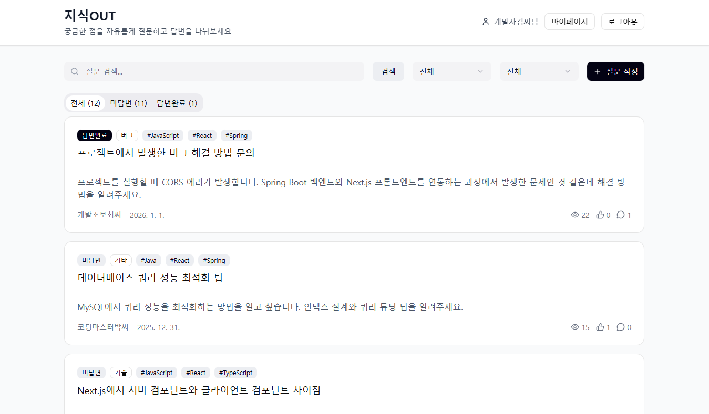

# 지식 OUT

질문과 답변을 통해 지식을 공유하는 커뮤니티 플랫폼입니다.

## 📋 프로젝트 소개

지식 OUT은 사용자들이 질문을 작성하고 답변을 통해 지식을 공유할 수 있는 Q&A 플랫폼입니다. 카테고리별 질문 관리, 태그 시스템, 추천 기능 등을 제공합니다.



## 🚀 주요 기능

### 사용자 기능
- **회원 관리**: 회원가입, 로그인, 로그아웃, 회원 정보 수정, 회원 탈퇴
- **질문 관리**: 질문 작성, 수정, 삭제, 검색, 필터링
- **답변 관리**: 답변 작성, 수정, 삭제
- **추천 기능**: 질문 추천
- **마이페이지**: 작성한 질문/답변/추천 내역 조회

### 관리자 기능
- **관리자 대시보드**: 통계 정보 조회
- **콘텐츠 관리**: 질문 및 답변 삭제 권한

## 🛠 기술 스택

[](https://openjdk.org/)
[](https://spring.io/projects/spring-boot)
[](https://nextjs.org/)
[](https://www.mysql.com/)
[](https://www.docker.com/)
### Backend
- **Java 21** - 최신 LTS 버전
- **Spring Boot 3.5.9** - 웹 애플리케이션 프레임워크
- **Spring Security** - 인증/인가
- **Spring Data JPA** - 데이터 접근 계층
- **MySQL 8.0** - 관계형 데이터베이스
- **Gradle** - 빌드 도구
- **Lombok** - Boilerplate 코드 감소

### Frontend
- **Next.js 16.1.1** - React 기반 풀스택 프레임워크
- **React 19.2.3** - UI 라이브러리
- **Tailwind CSS 4.1.18** - Utility-first CSS 프레임워크
- **Radix UI** - Headless UI 컴포넌트
- **Chart.js** - 데이터 시각화

### Infrastructure
- **Docker & Docker Compose** - 컨테이너화
- **MySQL 8.0** - 데이터베이스

## 📁 프로젝트 구조

```
KnowledgeOut/
├── backend/                 # Spring Boot 백엔드
│   ├── src/main/java/      # Java 소스 코드
│   ├── src/main/resources/ # 설정 파일
│   └── build.gradle        # Gradle 빌드 설정
│
├── frontend/               # Next.js 프론트엔드
│   ├── app/               # Next.js App Router 페이지
│   ├── components/        # React 컴포넌트
│   ├── features/          # 기능별 API 클라이언트
│   ├── lib/               # 유틸리티 라이브러리
│   └── package.json       # npm 의존성
│
├── docs/                  # 프로젝트 문서
│   ├── API명세서.md
│   ├── 기능명세서.md
│   └── 기술스택_개발환경.md
│
└── docker-compose.yml     # Docker Compose 설정
```

## 📚 주요 문서

- [기능 명세서](./docs/기능명세서.md) - 프로젝트의 주요 기능 설명
- [API 명세서](./docs/API명세서.md) - RESTful API 엔드포인트 문서
- [기술 스택 문서](./docs/기술스택_개발환경.md) - 사용된 기술 스택 상세 설명

## 🔐 인증 및 보안

- **세션 기반 인증**: Spring Security를 사용한 세션 기반 인증
- **BCrypt 암호화**: 비밀번호는 BCrypt로 해싱되어 저장
- **Soft Delete**: 데이터 무결성을 위한 소프트 삭제 방식
- **Role-based Access Control**: ROLE_USER, ROLE_ADMIN 권한 관리

## 🗄 데이터베이스

- **MySQL 8.0**: UTF-8 인코딩 (utf8mb4)
- **JPA/Hibernate**: ORM을 통한 데이터베이스 접근
- **DDL 자동 생성**: 개발 환경에서 자동 스키마 생성

## 🧪 테스트

### 테스트 데이터 삽입 SQL
- [테스트데이터_삽입_SQL](./테스트데이터_SQL.md)
- 테스트 데이터가 필요할 경우 해당 SQL 명령어 실행

### Docker-compose
- docker-compose.yml 파일과 동일한 디렉토리에 MY_SQL_PASSWORD 값을 설정한 .env 파일 필요
```
docker-compose up -d
```

### Backend 테스트
```bash
cd backend
./gradlew test
```

### Frontend 테스트
```bash
cd frontend
npm run dev
```

## 📝 개발 가이드

### Backend 개발
- 레이어드 아키텍처 패턴 사용
- Controller → Service → Repository 구조
- DTO를 통한 데이터 전송

### Frontend 개발
- Feature-based 구조로 기능별 분리
- Component-based 구조로 재사용 가능한 컴포넌트 작성
- API 클라이언트는 `features/` 폴더에 정의


## 🛠️ 프로젝트 트러블슈팅 리포트 (Troubleshooting Report)


## 1. 403 권한 문제와 JPA Lazy Loading(500 에러) 연쇄 발생

### 1. 문제 상황 (Issue)
* **상황**: 비로그인 사용자가 질문 상세 페이지(`GET /questions/{id}`) 접근 시 **403 Forbidden** 에러 발생.
* **상황**: 로그인 후 접근 시에는 **500 Internal Server Error** 발생.

### 2. 원인 분석 (Root Cause)
1.  **403 원인**: Spring Security 설정(`SecurityConfig`)에서 해당 URL 패턴(`/questions/**`)에 대해 `permitAll()` 설정이 누락되어 보안 필터가 접근을 차단함.
2.  **500 원인**: 
    * JPA 엔티티(`Question`) 조회 시 연관된 객체(`Member`, `Tags`)가 **지연 로딩(Lazy Loading)**으로 설정됨.
    * Service 계층(트랜잭션)이 종료된 후, Controller나 View에서 연관 객체를 호출하여 이미 닫힌 DB 세션으로 인해 프록시 초기화 예외 발생.


### 3. 해결 방법 (Solution)
1.  **보안 설정**: `SecurityConfig`에 `requestMatchers(HttpMethod.GET, "/questions/**").permitAll()` 추가.
2.  **DTO 도입**: Transaction이 살아있는 **Service 계층 안에서** 필요한 데이터를 모두 조회하여 `ResponseDto`로 변환 후 반환하도록 구조 변경.


## 2. 질문 카드 UI 중복 및 유지보수 효율성 문제

### 1. 문제 인식 (Issue)
* 질문 목록, 마이페이지, 검색 결과 등 여러 화면에서 질문 카드 UI를 각각 구현하면서 디자인이나 필드 변경 시 동일 작업을 반복해야 했고, 일부 화면에 변경 사항이 누락되는 UI 불일치 문제 발생.

### 2. 원인 분석 (Root Cause)
* UI 책임이 화면 단위로 분산되어 재사용이 불가능한 구조였으며, 도메인 개념(Question Card)이 독립된 컴포넌트로 관리되지 않아 변경에 취약했음.

### 3. 해결 방법 (Solution)
* 질문 카드 UI를 **`QuestionCard` 공통 컴포넌트**로 분리하고, 질문 데이터는 props로 전달하며 제어하도록 개선.

### 4. 얻은 인사이트 (Insight)
* UI는 화면 단위가 아닌 **도메인 단위**로 설계해야 유지보수성과 확장성이 높아진다는 점을 체감함.


## 3. 질문 삭제 시 연관 데이터 제약 조건 및 이력 관리 문제

### 1. 문제 인식 (Issue)
* 질문 삭제를 **Hard Delete** 방식으로 구현하면서 질문과 답변 간 연관 관계로 인해 FK 제약 조건 오류 발생. 또한 연관 데이터 일괄 삭제 시 사용자의 작성 이력 관리에 어려움이 있음.

### 2. 원인 분석 (Root Cause)
* 질문과 답변이 1:N 관계로 강하게 결합되어 있음에도 명확한 삭제 정책이 없었으며, 물리적 삭제가 데이터 무결성과 서비스 요구사항에 부합하지 않는 구조였음.

### 3. 해결 방법 (Solution)
* 질문 삭제 방식을 **Soft Delete**로 변경하여 실제 데이터를 제거하지 않고 삭제 상태(Status)만 변경하도록 설계.

### 4. 얻은 인사이트 (Insight)
* 삭제 기능은 단순 구현 문제가 아니라 **도메인과 데이터 흐름을 고려한 설계 문제**라는 점을 인식함.


## 4. 탈퇴 회원의 닉네임 처리 및 데이터 정합성 문제

### 1. 문제 상황 (Issue)
* 탈퇴한 사용자가 작성한 게시물의 닉네임 처리 방안 필요. 초기에는 `null` 설정을 논의했으나 엔티티 설계 및 기존 로직과 충돌 발생.

### 2. 원인 분석 (Root Cause)
* 닉네임을 이용해 정보를 조회하는 기존 로직이 존재하며, 엔티티 설계상 `null` 허용이 적절하지 않거나 화면 출력 시 예외를 발생시킬 수 있음.

### 3. 해결 방법 (Solution)
* 닉네임을 `null`로 바꾸는 대신 **닉네임 마스킹 처리**를 도입하고, 탈퇴 여부에 따라 화면 출력을 다르게 하도록 수정.


## 5. 탈퇴 회원의 질문 삭제 시 관리자 권한 로직 오류

### 1. 문제 상황 (Issue)
* 관리자 계정으로 탈퇴한 회원의 질문 삭제 시도 시 **500 Internal Server Error** 발생.

### 2. 원인 분석 (Root Cause)
* 로그 확인 결과, 관리자 및 질문 작성자 인증 로직에서 이메일 값을 비교하는 부분에서 에러 발생. 탈퇴한 사용자는 이메일 정보가 `null`이어서 비교 연산 중 예외 발생.

### 3. 해결 방법 (Solution)
* 질문 작성자 인증 기본값을 `false`로 설정하고, **회원 정보와 이메일 정보가 존재할 경우에만** 이메일 비교 로직을 수행하도록 수정하여 해결.


## 6. 데브 업데이트 후 DB 스키마 불일치로 인한 삭제 기능 오류

### 1. 문제 상황 (Issue)
* 개발 환경(Dev) 업데이트 이후, 기존에 잘 작동하던 질문 삭제 기능이 정상적으로 동작하지 않음.

### 2. 원인 분석 (Root Cause)
* **Soft Delete** 기능을 추가하면서 엔티티에 새로운 컬럼이 추가됨. 엔티티 코드는 수정되었으나 실제 DB 테이블 구조에 해당 컬럼이 반영되지 않아 데이터 수정 시 런타임 에러 발생.

### 3. 해결 방법 (Solution)
* JPA의 스키마 자동 생성 기능(`hibernate.ddl-auto`)이 변경된 엔티티 구조에 맞춰 테이블을 다시 구성할 수 있도록, 기존 DB를 **Drop**한 후 다시 **Create**하여 테이블 구조를 최신화함.

### 4. 결과 (Result)
* DB 스키마와 엔티티 구조가 일치하게 되어 질문 삭제(Soft Delete) 기능이 정상적으로 작동함을 확인.

---

# 📄 라이선스

이 프로젝트는 학습 목적으로 제작되었습니다.

# 👥 팀

- 멋쟁이사자처럼 Backend School 19기 8조 Infinity_∞
